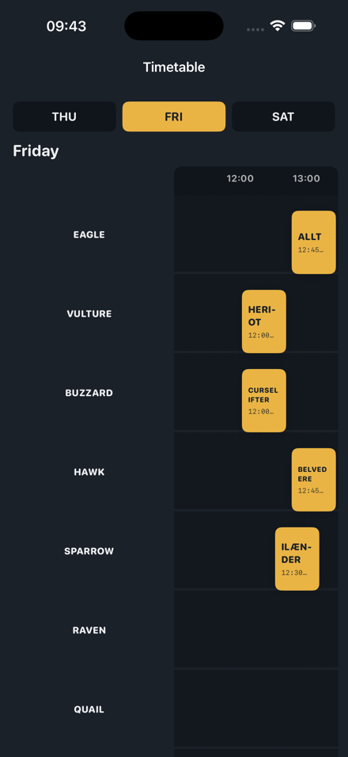
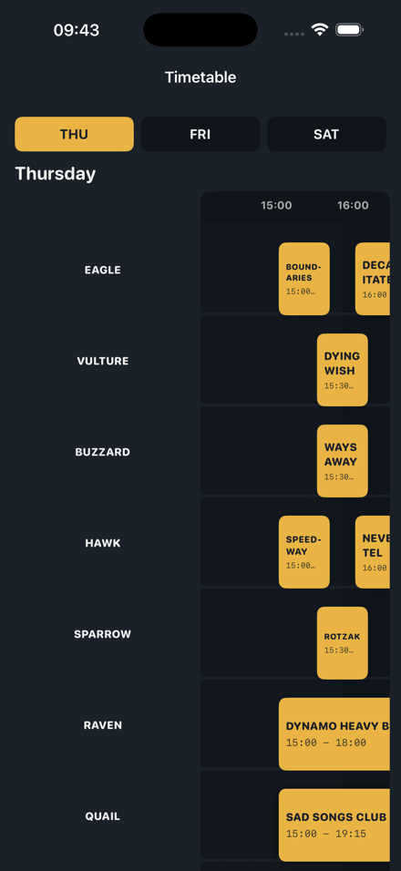
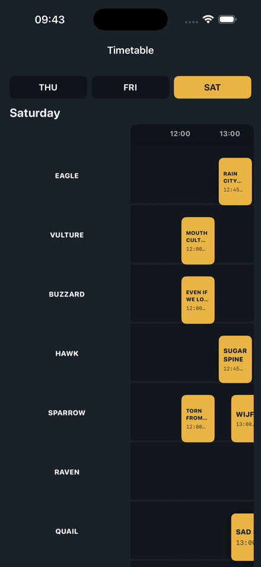

# Jera On Air Timetable

A simple iOS app that shows the [Jera On Air 2026](https://www.jeraonair.nl/nl/timetable/) festival timetable for Thursday, Friday, and Saturday.

## Screenshots

Captured on iPhone 17 Pro Max simulator.

| Friday (auto-selected on festival days) | Thursday | Saturday |
| --- | --- | --- |
|  |  |  |

## Features

- Day tabs (THU / FRI / SAT) styled like the festival website
- Grid timetable with stages as rows and time as columns
- Gold performance blocks with band name and time range
- Red current-time marker during live festival hours
- Automatically selects today's festival day when you open the app
- Automatically scrolls horizontally to the current time on the active day

## Open in Xcode

```bash
open JeraOnAir/JeraOnAir.xcodeproj
```

Select an iPhone simulator or your device, then run.

You can also build and run with [FlowDeck](https://docs.flowdeck.studio/cli):

```bash
cd JeraOnAir
flowdeck run -w JeraOnAir.xcodeproj -s JeraOnAir -S "iPhone 17 Pro Max"
```

## Update timetable data

The app ships with bundled timetable JSON scraped from jeraonair.nl. To refresh it:

```bash
python3 JeraOnAir/Scripts/update_timetable.py
```

Then rebuild the app in Xcode.

## Project layout

- `JeraOnAir/JeraOnAirApp.swift` — app entry point
- `JeraOnAir/ContentView.swift` — day tab bar and navigation
- `JeraOnAir/Views/TimetableDayView.swift` — scrollable grid timetable
- `JeraOnAir/Models/TimetableModels.swift` — data models and loader
- `JeraOnAir/timetable.json` — bundled timetable for all three days
